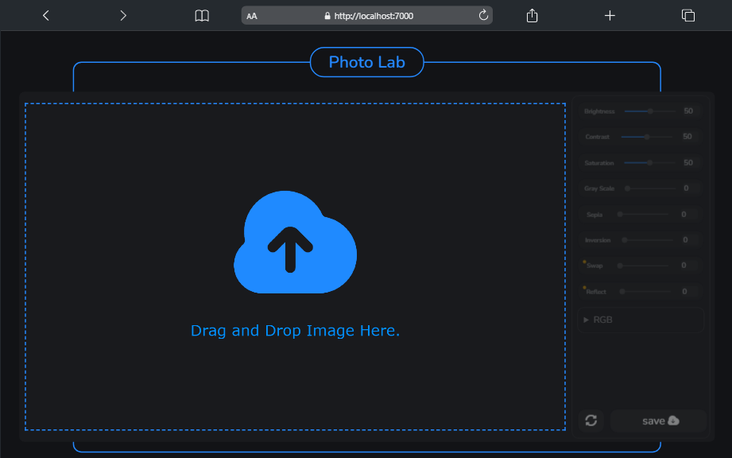
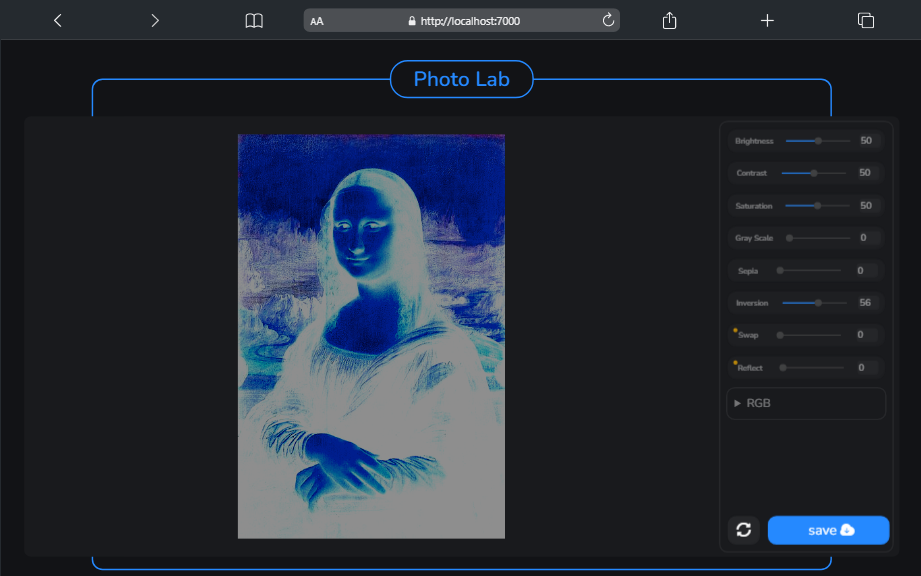

# Photolab

## overview:
`Photolab` is a small version of GIMP and photoshop

## screenshots:
- ### Drop image to start:
using drag/drop event to easily start processing your image.

- ### ready to start:
ready to start processing your image by activating the editor sidebar after you drop the image.

- ### Processing:
the processing is use the [`Canvas Api`](https://developer.mozilla.org/en-US/docs/Web/API/Canvas_API) withe the `2D Context` `canvas.getContext('2d');`
and image processing algorithms not usining any of `CSS filters` or `Context filters` `ctx.filter = "filter(val%)"`, none of that i create the filters algorithms from scratch with some `custom filters` that i made  like `swap filter` and `reflect filter`.

