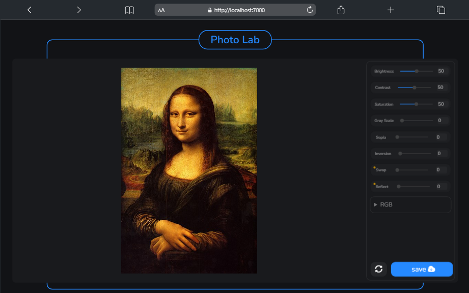

# Photolab

## overview:
Making a small web version of GIMP and PHotoshop under the name of `Photolab`. for processing images 🌇 using range filters like: `Brightness 🔅`, `Contrast 👁️`, `Saturation 🌈`, `Grayscale `, `Sepia 🟨`, `Invert 🩻`, beside **Red** , **Green** , **Blue**  channels. with some additional magic filters that i made like `Swap` filter that swap the **__RGB__** values of every image px, and the `reflect` filter basically is just invert filter but in a swap way.

## screenshots:
- ### Drop image to start:
Using drag/drop event to easily start processing your image.

- ### ready to start:
Ready to start processing your image by activating the editor sidebar after you drop the image.

- ### Processing:
The processing is used in the [`Canvas Api`](https://developer.mozilla.org/en-US/docs/Web/API/Canvas_API) with the `2D Context`, and **`Image Processing Algorithm`** to create standard range filters. with the save feature, to save your edited image in [`LocalStorage`](https://developer.mozilla.org/en-US/docs/Web/API/Window/localStorage).

# Note ?:
note that the `Photolab` web app, use only filters there is no physical manipulation for the image from move, resize, rotate... to layers.
also note that the app uses the localStorage with it small capacity of storage so it will not store larg images (over 3MB).
